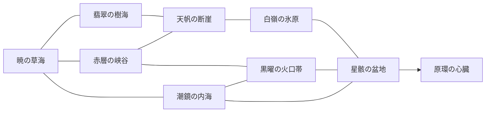

# 原環の大地 ― ヴァルナ年代記 ― 制作設計書

版：2026-09-21 / 企画基準案。原文は `source-request.txt`。本書の固有名・生態・歴史は創作であり、実在の古生物の復元資料ではない。

**制作方針：命が地形をつくり、地形が物語を隠す。** 壮観を見つけ、痕跡を読み、生物に働きかけ、移動経路と人々の暮らしを変える。この循環を、75〜90時間の本編と245〜330時間の有限な全達成目標へ広げる。時間と規模は未検証の制作目標である。

この設計書は完成ゲームの機能一覧ではない。現行の初期制作対象は、暁の草海〜翡翠の樹海の一部とオルガを扱うブラウザ検証版。本書の地域、クエスト、生物一覧は原則として**設計案・本実装未着手**であり、実装・検証の事実は `production-roadmap.md` とプロジェクトの検証記録で別に管理する。

## 1. 企画の核

| 項目 | 方針 |
| --- | --- |
| 形式 | ソロ主体、三人称オープンワールド・アクションRPG。初期製品対象PC、マウス・キーボード／ゲームパッド |
| 主人公 | 名と外見を設定できる若い「渡り読み」。姉との関係、故郷、職能は固定 |
| プレイヤーの欲求 | 遠景の正体を確かめたい → 生物の行動を理解したい → 暮らしを守る解を試したい |
| 最優先品質 | 動く景観、生物の重量と体表、透明な水、霧、広い遠景。UIを閉じても読める世界 |
| 主要ループ | 眺望 → 痕跡 → 仮説 → 準備 → 実行 → 世界変化 → 新しい眺望 |
| 避ける作業 | 義務的ログイン、現実日付の解放、無目的な反復討伐、極端な抽選、取り返せない図鑑欠損 |
| 完成の条件 | 数量、画質、操作感、物語、保存、性能の各判定を満たす。企画書の存在で完成としない |

探索中は小さな発見の間に、静かに歩く時間を残す。すべての岩に印を付けず、鳴き声、群れの向き、樹木の傷、霧の切れ間が進路を示す。足跡の色塗りスキャンは任意補助で、通常画面にも同じ情報が存在する。

最初の30分の景観構成は、(1)低い霧の向こうを横切る草食群と日出、(2)渓谷の上空を通る翼竜の影、(3)滝壺と巨木の間から見える環状山脈。すべて通常操作中に見せ、見逃した場合も戻って観察できる。

## 2. 世界の仕組みと五つの時代

「原環」は、生命と環境の変化を記録して再生する、母獣アーケア由来の仕組みである。生き物を一瞬で復活させる万能装置ではなく、種、気候、土壌、共生関係を組み合わせて世代単位で再生する。古代文明は、その一部を複製した「記憶床」を各地につくった。

異なる時代に着想を得た生物が同居するのは、異なる記憶床が同時に動作しているため。ゲーム内図鑑では「創作種」「形態の着想」「世界内で確認した生態」を分け、創作能力を古生物学の事実として説明しない。

| 時代 | 何が起きたか | 歩いて見つける証拠 | 現在の争点 |
| --- | --- | --- | --- |
| 原跡期 | 巨大生物が回遊し、踏圧で河道と草地を変えた | 岩に重なる足跡層、向きのそろった河床、山脈状の殻 | 自然景観と思われていたものにも生命の意志がある |
| 渡り火期 | 人々が季節と群れを追って移動した | 車輪幅の違う旧道、持ち運べる炉、群れを示す星図 | 固定した土地の所有と、移動する暮らしの衝突 |
| 環都期 | 記憶床で収穫、天候、寿命を管理する環都文明が繁栄 | 水圧で開く門、菌糸の冷蔵庫、骨の構造を写した橋 | 古代技術は現在の病人と都市も救える |
| 白い静止期 | 病気と飢餓を恐れ、季節と回遊を固定した。土壌が疲弊し、維持負担が連鎖した | 同じ作物の花粉だけが続く地層、成長線が止まる柱、未完成の避難図 | 崩壊は一度の爆発ではなく、便利さを手放せなかった連鎖 |
| 継火期・現在 | 残存装置に依存する集落が再建され、復元局が熱源を再始動した | 遺跡に継ぎ足した民家、転用した門の市場、異なる世代の修理跡 | 北の熱流を南へ迂回したことが、故郷を襲う回遊崩れの引き金 |

北方の温かな谷が冷え、ウルマの群れが南へ移動し、草原の群れが押し出され、捕食者と交易路も動いた。復元局の操作は都市の疫病対策のためであり、被害を予見できる資料を石環院が保管したまま公開しなかったことも原因。特定人物を倒せば解決する事件にはしない。

用語：渡り読み＝痕跡と地形から回遊を予測する職能／記憶床＝地域の再生機構／環律＝水・種子・熱・土壌の循環周期／共振杭＝古代装置の調整器／証の束＝異なる分野の証拠を組み合わせた仮説。作中の台詞では、初出時に実物と行動で意味を示す。

## 3. 人物と勢力

### 主要人物

| 人物 | 欲しいもの・弱点 | 秘密と主人公との衝突 | 変化／終盤の役割 |
| --- | --- | --- | --- |
| 主人公（呼称：渡り読み） | 姉と故郷の安全。人の頼みを抱え込みやすい | 故郷の異変の前兆を、祭りを中止したくない気持ちから軽く見た | 自分一人で救う発想から、住民に情報と決定権を渡す責任へ |
| 姉・ミオ | 循環再開。緊急時に説明を省く | 熱流停止を知り、許可を待たず装置を操作した。避難すれば守れる命を計算に入れて都市を見捨てる判断をする | 人を数として扱った後悔から、最後は移住者に付き添う。共存ルートでは公開観測網を運営 |
| 渡り読みの師・サガ | 最後の回遊地図を残す。脚を患っている | 若い頃に旧道を売り、柵による分断のきっかけを作った | 地図の唯一の所有者をやめ、後継者が改訂できる共同記録を残す |
| 灯台守・リネ | 港の子どもを飢えさせない。損失を恐れて判断を遅らせる | 水門を閉じた命令書に署名した。開門で倉庫を失う | 貨物より避難船を優先し、浮桟橋の新しい港をつくる |
| 石環院の研究者・エン | 生きた証拠を残す。正確さのため公表が遅い | 改ざんされた崩壊年代を知っていたが、学派を守るため黙っていた | 不確実さを明示した公開研究へ。ラスボスの器官を地形から推定 |
| 復元局技師・バルド | 都市の病院に熱と清水を届ける。機械を過信 | 北の熱源を転用した責任者。病院停止を恐れ、北の被害を認められない | 地域ごとの手動維持装置を住民へ教える。人間管理ルートの責任を引き受ける |
| 保護飼育者・トア | 幼体を巣へ帰す。人間社会に不信 | 違法な卵の交易で育ち、保護個体の中に盗まれた卵がある | 単純な解放で死ぬ個体も認め、段階的な野生復帰を行う |
| 運び手・ナギ | 一人でも旅できる力。危険を過小評価 | 群れを傷つけた荷役事故を自分の失敗として隠す | 荷物の量より道の設計を変え、各地の運び手を避難路に結ぶ |

同行者は主人公に代わって解決せず、現地で観察できる別の情報を出す。野営地の短い会話は直前の出来事を参照し、攻略順が違っても未遭遇の人物や地域を既知として話さない。

### 四勢力

| 勢力 | 守りたいもの／抱える問題 | 具体的な対立 | 協力を得る行動と結果 |
| --- | --- | --- | --- |
| 渡りの民 | 移動の自由と生態の口承／伝承を部外者に渡さず、女性や若手の解釈を軽視する一派 | 定住集落の柵、研究者による採集、土地の所有権 | 公開の回遊地図と通行協定をつくる。回遊に沿う補給隊が終盤を支援 |
| 灯台同盟 | 港、食料、交易の信用／内陸の事情を後回しにする | 水門開放による倉庫水没、渡りの民の河川通行 | 洪水位を実測し浮倉庫を試す。避難船と潜水装備を供給 |
| 石環院 | 記録と技術の継承／知識を資格で独占 | 復元局の実用優先、渡りの民の口伝、住民の装置転用 | 証拠を失わず住民に公開する。複数の攻略仮説が図鑑で開く |
| 復元局 | 都市の医療・清水・仕事／依存を解消する計画がない | 北方の熱源配分、遺跡の解体、保護区域の工事 | 小さな代替熱源を実証する。終盤で装置停止と医療継続を両立 |

評判は善悪の単一数値ではなく、「約束を守った」「情報を公開した」「資源を分けた」の具体的事実で管理する。全勢力の協力は可能だが、同じ土地と設備を無制限に共有できるわけではなく、配置と運用の妥協が必要になる。

## 4. 五幕と自由な攻略順

| 幕 | 主クエストの流れ | プレイ上の転換 | 目安・本編専有時間 |
| --- | --- | --- | --- |
| I：帰らない渡り | M01「草が伏せる朝」群れから住民を誘導 → M02「姉の観測杭」足跡を追う → M03「川底の道」最初の遺跡 → M04「持ち運ぶ故郷」調査隊を発足 | 観察が戦闘回避と救出に結びつく。四地域の入口を知る | 6〜8時間 |
| II：四つの綻び | 四地域それぞれ「被害確認→原因の仮説→住民の対立→対策準備→中ボス」の支線を開始。最初の2地域を解決すると「同じ周期の傷」が発生 | 水・種子・熱・土壌の異変が接続する。選んだ2体に応じた証拠で姉へ到達 | 24〜28時間 |
| III：救うものの数 | M20「生きていた観測者」姉と再会 → M21「白い畑」固定された季節の跡 → M22「病院の炉」技師の動機を知る → 残り2地域を解決 → M23「公開する地図」勢力会議 | 姉と対立しても同行関係は消えない。残りのボスの解決に新たな意味が加わる | 22〜26時間 |
| IV：動き出す山 | M30「流れの代償」各地の浸水・地熱変化に対応 → M31「影の測量」山脈が動く証拠を集める → M32「移すべき家」避難と維持計画を試す → M33「原環への航路」 | 自分の地域変化が災害の規模も救出手段も変える。最終方針の条件を確認できる | 13〜16時間 |
| V：次の季節 | M40「背殻の岸」覚醒から脱出 → M41「記憶の呼吸」器官を攻略 → M42「未来を担うもの」最終対決 → M43「新しい帰り道」選択後の暮らしを歩く | 観察と協力の成果が攻略経路になる。選択後も同じセーブで生活が続く | 10〜12時間 |

範囲合計は75〜90時間。これは脚本と演出の量の予約であり、実測済み時間ではない。

**順序制御：** 四地域の主要入口は最初から陸路・船便・登山道で到達可能。オルガの地下道、ネレムの潜水、セイラの滑空、ウルマの温熱装備は探索を広げるが、他の中ボスの必須条件にはしない。検証版でオルガだけを扱うことは、完成版の攻略順固定を意味しない。

脚本は `guardianResolved` の集合と解決数、地域知識の集合を参照する。2体解決時に再会、4体解決時に第四幕を解放。四つの証拠は、それぞれ単独で理解できる「局所的事実」と、既知の証拠に接続する「解釈」を持つ。ウルマを先に解決した場合は「北の熱の迂回」を先に知り、後から故郷への連鎖を確かめる。最後に解決した場合は既知の異変が因果関係としてまとまる。24通りの攻略順を自動検証対象にする。

終盤直前に、利用可能な結末の条件、未解決の避難問題、取りに戻れる証拠を手帳へ明示する。結末のために全収集を要求しない。

## 5. 地域と移動の設計

| ID・地域 | 見た目／音／気候 | 主ランドマークと人の暮らし | 食物連鎖と固有の探索 |
| --- | --- | --- | --- |
| R01 暁の草海 | 金緑の草、薄紫の影、朝霧。草を渡る風と低い呼気 | 傾いた巨石「渡りの門」、大河の折れ曲がり。移動式の炉と布屋根 | 草→群居草食→追跡肉食→腐食者。踏み固めた道、渡河時刻、風下への接近 |
| R02 翡翠の樹海 | 深緑と淡い琥珀、雨後の葉、層の厚い霧。枝鳴りと滴 | 中が空洞の「百階樹」、根に浮かぶ住居 | 果実→樹上小動物→滑空捕食者。地表、幹、樹冠、根の洞窟を往復 |
| R03 赤層の峡谷 | 赤土、白い骨、青黒い影、砂嵐。岩孔の笛 | 壁に刺さる「横たわる肋橋」、地層職人の段丘集落 | 種子→岩鼠→待ち伏せ獣。地層の色と風音で埋没入口を推理 |
| R04 潮鏡の内海 | 青緑の浅海と濃紺の海溝、白い干潟。波と係留索 | 二本の塔が残る「逆さ都」、浮桟橋の市場 | 海草・微生物→小魚・殻類→海生爬虫類。潮位、濁り、息継ぎ、船の喫水 |
| R05 天帆の断崖 | 白い雲海、冷たい青、草の黄。風の層と翼音 | 空へ割れた「帆柱峰」、風除け壁の集落 | 高山草→種子運搬翼竜→営巣捕食者。上昇気流と安全な着地面を読む |
| R06 白嶺の氷原 | 青白い氷、温泉の錆色、夜の極光。雪の吸音と氷鳴り | 氷下に眠る「逆さ滝」、断熱した半地下住居 | 苔・低木→大型長鼻類→追跡獣。雪質、群れの踏み跡、氷下の水音 |
| R07 黒曜の火口帯 | 黒い砂、鈍い橙、灰色の空、地下の薄緑。地鳴りと湯気 | 「黒い花冠」の火口壁、地熱工房 | 菌類→地中小動物→熱孔捕食者。熱分布、煙の周期、足場の冷却 |
| R08 星骸の盆地 | 石灰色の骨、紺の夜、点状の発光。風に鳴る殻と静寂 | 「最後の円卓都市」、観測者の仮設集落 | 微生物→殻の濾過者→回遊捕食者。骨格・建築・星図を重ねて地下断層へ |
| R09 原環の心臓 | 地形のような層状殻、湿る膜、低く移動する光。呼吸と反響 | 生物の背に成立した森と海、人工の模倣装置 | 微小な共生者が巨体を維持。呼吸周期で通路・水位・安全な足場が変わる |

### 接続と能力

線は地形が連続する主要経路。R04→R08は序盤には定期船による調査者向け航路として接続し、後に自船で海溝を越える。心臓への実踏は四地域の循環復旧と第四幕の準備が必要。遠景の見学やR08の一部調査は早期から可能。

| 手段 | 利点・制約 | 能力獲得後の再訪例 | 代替進路 |
| --- | --- | --- | --- |
| 徒歩・登攀 | 細い道と痕跡に強い。疲労は休息ですぐ回復 | 根の抜け道、崖裏の観測所 | 道具で短い梯子を固定 |
| 騎乗 | 草原と浅い河を速く渡る。急斜面・密な根・深水は不得手 | 群れと並走し移動中の生態を観察 | 徒歩の渡し場と集落の船便 |
| 根道の利用 | オルガ解決後、倒木・根洞の移動網が開く | R02からR03地下へ短絡 | 地表の長いが安全な峠道 |
| 潜水 | ネレム解決後に深度と継続時間を拡張。回収補助で窒息反復を防ぐ | 沈没図書館、氷湖の底 | 低潮時の露出入口、空気溜まり経由 |
| 滑空 | セイラ解決後に上昇気流が安定。無限上昇・空中静止は不可 | 樹冠の採種台、峡谷の壁画 | 崖道、対岸の索道、季節風待ち |
| 船 | 沿岸補給と荷運びに強い。喫水・風・潮流を読む | 浮倉庫、流れる島 | 船便。強制的な長距離手漕ぎを要求しない |
| 温熱経路 | ウルマ解決後、氷下道と火口の安全帯を利用 | 凍結水路、地下菌類林 | 防寒具・換気洞経由の限定ルート |

ファストトラベルは訪問済みの野営地を結ぶ。無制限の任意地点転移ではなく、救助中など一時制約がある場合は理由と解除条件を示す。クエスト進行を失わず中断して帰還できる。

## 6. 四体の中ボス

中ボスは「強い雑魚」ではなく、地域の循環を担う固有個体。討伐で問題を解く場合も装置の異常を解消する工程を残し、個体を倒しただけで生態系が修復されるとは描かない。主要決着は共通の成長点・同等価値の素材代替を与える。固有装飾と地域の痕跡だけを変える。

共通ルール：体力とは別に姿勢・警戒・装置負荷を持つ。大型攻撃は姿勢、方向、音、地面の変化で予告する。予告時間、回復時間、当たり範囲は試作で調整し、初見テストで読めるかを確かめる。高速な不可視攻撃、壁越しの攻撃、旋回中の不自然な追尾は採用しない。段階間の再開地点と短縮導線を保存する。

### B01 翠角王オルガ／土壌の循環

- **前兆：** 角が削った幹に同じ間隔の三本傷。巨体の足跡の横に幼体の小さな足跡。共振杭の周囲だけ鳥が鳴かない。
- **調査：** 草を食べるときは穏やかだが、杭の共振時に頭を振ることを確認。トアと幼体の安全地をつくるか、避難用の木柵を先につくる。先行準備は戦闘中の救出負担を減らす。
- **場所：** 草原と樹海の境界。泥地、根の高台、折れる朽木、壊せない避難岩で環状の経路をつくる。外周で落下死させることはできない。
- **第1段階「道を奪う角」：** 前脚を擦り、角の方向を固定して突進。横へ抜け、朽木へ誘うと背部の外殻が見える。真正面の弱い攻撃は弾かれるが、重武器は小さな姿勢蓄積を与える。
- **第2段階「痛みの共振」：** 地面を叩いて泥を巻き上げる。乾いた根の高台へ移り、共振杭を停止。投射具か接近で留め具を外す。杭の発光だけでなく震動音と粉塵でも状態を伝える。
- **第3段階「最後の守り」：** 倒木が新しい橋になる。幼体側へ向かう進路を遮らず、香りの杭で安全帯へ誘導し、短い静止時間に装置を抜く。討伐ルートでは露出部へ攻撃するが、同じ地形理解が必要。
- **決着：** 解放個体は群れとともに新しい道をつくる。討伐時は別個体の群れの誘導を住民と行い、倒れたオルガを風化する記念地として残す。進行能力・報酬量は同等。
- **世界変化：** 根道開通、草食群の分散、草海の採食圧低下、木陰の新しい交易休憩所。保存値 `rootRouteOpen` は決着と同時に確定し再読込でも保持。

### B02 潮葬竜ネレム／海の循環

- **前兆：** 浜の死骸が片付かず、泡の帯が閉鎖水門で折れる。船を襲う前には必ず近くで一度呼吸する。
- **調査：** 濁りの中の輪郭、潮の予報、浮いた海草から回遊線を作図。リネと浮桟橋を試し、開門に備えて荷物を移す。怠れば戦闘中の救助が増えるが失敗で永久欠損にはしない。
- **第1段階「干潟の影」：** 浅水と干潟を移動。尾の波、呼吸音、浮く砂が接近方向を示す。背の残骸を外して警戒を下げる。地上から全身が見える学習区間。
- **第2段階「船底の鼓動」：** 船と浮いた遺跡を短い距離で乗り継ぐ。水中へ消えたら呼吸の候補地点が複数現れ、流れの向きで絞れる。見えない間にも舵・係留・水門準備という能動行動がある。
- **第3段階「逆流の門」：** 空気溜まりのある短い潜水通路で水圧弁を切替。流れが変わると安全な浅瀬へ出て、ネレムの突進を門の破損部へ導く。潜水中の急な時間切れを防ぐ戻り口を常に示す。
- **決着と変化：** 開門して回遊を回復。討伐の場合も水門を開き、死骸の深海移送を住民が始める。潜水装備、潮位予報、新航路、露出する遺跡を解放。港の倉庫は浮倉庫か高台倉庫に変わる。

### B03 天帆翼セイラ／種子の循環

- **前兆：** 峰の片側にだけ種子が積もり、古い巣の壁に砂が吹き込む。翼の傷で旋回方向に偏りがある。
- **調査：** 巣材、風見草、落ちた種子を調べて人工嵐の周期を測る。古い索道を直すか着地棚を補強し、戦闘経路を選ぶ。
- **第1段階「横風の狩り」：** 峰を結ぶ三つの着地場を移動。空中を待つのではなく風向装置を切り替え、セイラが休む棚を作る。滑空は現地の貸出具でも可能にし、他ボス能力を要求しない。
- **第2段階「砕ける巣」：** 嘴の突きと翼の風圧が足場を部分破壊。安全な石柱、補強済みの棚、崩れる外縁を形と音で区別。傷のある翼側へ回ると無理な急旋回をせず別の攻撃に変わる。
- **第3段階「雲の切れ目」：** 嵐装置の放電前に、複数の峰から遮風弁を開く。セイラはプレイヤーを追いながら休める峰を選ぶ。行動を観察して誘導すると、羽に絡んだ導線を外せる。
- **決着と変化：** 嵐が止まり、安定した上昇気流と新しい巣ができる。討伐では小型翼竜群の営巣を保護して種子運搬を補う。新しい花や虫が他地域に現れ、景観の変化を図鑑の続報として通知。

### B04 白嶺祖母ウルマ／熱と記憶の循環

- **前兆：** 雪に残る一本の古い道を群れが離れない。温泉の跡だけ雪が薄く、熱源の止まった日時が故郷の異変より先にある。
- **調査：** サガの古地図を現地の雪と照合し、幼体・老体で踏める氷が違うことを学ぶ。バルドの迂回熱管を見つけ、病院を止めずに北へ熱を戻す方法を試す。
- **第1段階「群れの壁」：** ウルマは群れとの間へ入った者を優先して威嚇。横向きの鼻、雪を払う前脚で進路を示す。安全な側へ離れ、軽い装備で熱管に接近。
- **第2段階「割れる記憶」：** 薄氷が鳴り、踏み抜きで地形が変わる。薄い場所は半透明と細かな裂け目で分かる。重い攻撃を厚氷へ誘い、雪崩の前兆音に合わせて岩陰へ退避。群れを崖へ落とす攻略は成立させない。
- **第3段階「谷へ帰る」：** 吹雪の合間に熱源を復旧し、ウルマの突進から配管を守る。古い経路の匂い杭と温まった地面で群れを誘導。戦闘と復旧が同時に進む。
- **決着と変化：** 温かな谷、氷河下道、温熱装備。討伐時には後継個体と渡り読みが移動を引き継ぐが、老個体だけが覚えていた道は研究クエストになる。故郷の異変が熱流転用から生じたことを証明。

## 7. 原環母獣アーケアと結末

アーケアは層状の殻、節ごとの小さな海、膜を濾過する共生者からなる超巨大生命。通常の恐竜やドラゴンの拡大ではない。山脈の縞を「成長層」、断続する霧を「呼気」、不自然な川の折れを「殻の縫合」と読み替えることで、序盤の景色が伏線になる。

四つの循環が戻ると、損傷した感覚器官が現在の生命を「固定された過去の汚染」と誤認し、全面再生を始める。悪意はなく、働きかける器官を見極める必要がある。

| 局面 | 操作と判断 | 過去の行動が返る場所 | 保存点 |
| --- | --- | --- | --- |
| 目覚め | 割れる地形を渡り住民の最後の隊列を逃がす | 根道・船便・運び手が避難時間を変える | 覚醒演出直後と安全な背殻到達時 |
| 背殻の森 | 呼吸で上下する川と森林を移動。器官の位置を観察 | 写真・骨格・波形の研究で経路を推定 | 三つの器官入口ごと |
| 感覚器官 | 巨大な触角・殻・濾過膜と直接戦闘。傷を増やすか誤認を解くかで対処が変わる | 生物との絆は荷運び・索敵・潜水支援として働く | 器官攻略完了ごと |
| 再生の拍動 | 波・熱・光の周期を合わせ、進む経路を選ぶ | 公開研究・代替熱源・避難計画が選択可能な最終操作を増やす | 最終選択前に帰還可能な保存点 |
| 次の季節 | 選んだ手順をプレイヤーが実行し、変化した故郷へ戻る | 協力者がそれぞれの代償を負い、仕事を続ける | 結末後世界の独立した状態を保存 |

| 結末 | 条件と最終操作 | 代償 | クリア後の世界 |
| --- | --- | --- | --- |
| 継火：人間が維持する | 本編で得る装置操作知識を使い、母獣の中枢を停止 | 人々は永続的な保守を担い、回復が遅い土地が残る | 地域ごとの管理拠点と修復依頼。ミオとバルドが維持教育に協力 |
| 渡り：自然へ返す | 本編内の避難計画を完成し、誤認を修正して再生区域を限定。居住地を移す | 古い都市と墓所の一部を手放す | 移動する集落、再生中の原野。旧都市の記録を救う遠征 |
| 共環：循環を分担する | 公開観測網、浮倉庫、代替熱源、回遊協定の実証を揃え、分散した調整を行う | 全地域を固定できず、一部の集落は移住。管理権の独占を手放す | 季節ごとに運用が変わる共存地域。トアとエンの研究が新しい道を開く |

第一・第二結末は本編内の行動で到達できる。第三結末の四条件は関連サイドチェーンと対応し、いずれも終盤から回収可能。討伐／非殺傷の一度の選択だけで第三結末を永久封鎖しない。異なる方法の生態代替を実証すればよい。

章再訪は「別の記録」としてセーブを分岐し、選んだ結末の世界状態を上書きしない。研究と衣装など共有してよい報酬は明示して共有する。全達成には三結末の章再訪を含めるが、三周の最初からの周回を要求しない。

## 8. 戦闘・成長・装備

### 六つの成立する戦い方

| 系統 | 主道具と判断 | 強み | 弱み・組み合わせ |
| --- | --- | --- | --- |
| 砕き手 | 石槌・重槍。重心が移る瞬間を狙う | 硬い外殻の姿勢崩し、障害の破壊 | 大振り。牽制具で回復時間を作る |
| 走り手 | 短槍・双鉤。踏み込みと離脱を連続 | 隙間の部位と装置留め具 | 正面の硬皮に弱い。位置取りが価値 |
| 射手 | 弓・投槍器。音・匂い・糸の投射を使い分け | 部位操作と誘導、遠い装置 | 遠距離だけでは器官を解除できず接近工程が残る |
| 仕掛け師 | 重り罠、倒木索、振動杭 | 進路と地形を変える | 同じ罠の連続使用は学習される。移設で対応 |
| 共生者 | 警戒合図、索敵、荷運び、救助 | 複数の役割を連携 | 相棒を攻撃の盾にしない。危険時は退避指示が必要 |
| 渡り読み | 足音・風・体温・警戒の研究 | 危険の回避、非殺傷、準備の節約 | 戦闘中の判断と装置操作を省略できない |

HPだけでなく、外皮、姿勢、疲労、警戒、部位状態を区別する。外皮の違いは材質と攻撃音で伝える。部位破壊は行動を変え、翼を傷つけた後に以前と同じ滑らかな飛行を続けない。

ロックオンは頭だけに固定せず、部位選択と全身を捉える距離を使い分ける。壁接近時はカメラを寄せて遮蔽を透過し、敵だけが画面外から攻撃する状態を検証する。難易度は予告時間、被ダメージ、援助、照準補助を調整し、物語上の結末条件を変えない。

### 四領域の成長

| 領域 | 初期 → 中期 → 後期の能力例 |
| --- | --- |
| 戦闘 | 受け流しの基本 → 姿勢崩しから部位へ移る → 道具を持ち替えず誘導と攻撃を連携 |
| 探索 | 足場を読む → ロープ固定・気流利用 → 他者も使える短絡路を施工 |
| 生態理解 | 痕跡の新旧 → 警戒と季節行動の予測 → 群れの進路を人間の通行と両立 |
| 工作 | 道具修理 → 罠の反応条件と重りの調整 → 地域環境に合わせた装備構成 |

拠点で無料の振り直し。装備構成を6枠以上保存し、必要道具が不足する場合は変更前に示す。能力解放は発見・試作・実践の組み合わせで、同じ技を何百回使う実績にはしない。

装備は武器2枠、機能道具3枠、外套・足具・呼吸具を基本とする。機能道具の組み合わせで風・雪・水・熱への対応が変わる。防御値だけ高い装備がすべてを上回らない。探索必須能力は装備重量や装飾で失われない。

素材は脱落した角片、抜け羽、樹脂、鉱物、遺跡の再利用部材などでも入手できる。討伐限定の性能必須素材は設けない。ユニーク装備は確定入手し、抽選は外観の細部程度に留める。空腹・渇きの常時ゲージは基本採用しない。料理は出発前に選ぶ遠征効果として扱う。

## 9. 生態・観察・共生

主要種は、食事／移動／休息／警戒／逃走／威嚇／保護／負傷の状態と遷移条件を持つ。群れは共有の進路を持つが個体間隔、年齢、疲労で動きがずれる。単独個体は食料と安全地を優先する。プレイヤーへの敵対は距離、匂い、視線、幼体、逃げ場、過去の接触で決める。

遠方では生息域・頭数・資源・移動方向を低頻度で更新し、近づくと実個体へ展開する。消えた群れが目の前に再出現しないよう、状態と移動経路を引き継ぐ。近傍の捕食・逃走・踏圧を可視化し、資源循環の全世界リアルタイム計算は要件にしない。

重要種の保護区域と再訪イベントを持ち、狩猟や物語の分岐で永久絶滅しない。生態変化は「回復」「分散」「採食圧」「水質」の地域状態として保存し、実時間ではなくゲーム内の休息・移動で変化させる。

図鑑の三層は、遭遇記録、行動の理解、環境との関係。各種の完成課題は3〜5個を目安とし、全種に同じ写真・討伐・採集を要求しない。たとえば群れの進路の予測、脱皮場所の発見、呼吸周期の測定、種子の移送先の確認。困った場合は手帳で「観察場所→見る現象→解釈」の順に任意のヒントを開く。

| 共生役割 | 絆をつくる共同活動 | できること／できないこと |
| --- | --- | --- |
| 草原の騎乗獣 | 群れへ帰す、初めての渡河を支える | 草原を速く走る。急崖と深海は進めない |
| 鼻の利く小型獣 | 埋もれた巣を一緒に探す | 痕跡候補を知らせる。答えを自動回収しない |
| 荷運び獣 | 重心と坂を考えて荷を分ける | 遠征資材を運ぶ。戦闘では安全地へ退避 |
| 潜水の相棒 | 漁具から解放し安全な息継ぎ地点を巡る | 潮の変化と帰路を知らせる。酸素管理を完全無効にしない |
| 滑空の相棒 | 巣材を運び風を読む練習 | 限られた区間の風を示す。無限飛行はしない |

個体差は好みと動作の違いとして見せ、訓練で役割を調整できる。相棒は瀕死時に離脱して回復でき、長期間の愛着を一度の操作ミスで失わせない。

## 10. 調査隊の拠点

拠点「継火の庭」は、故郷から持ち出した炉と布屋根から始まる。全施設を一度に置く建築メニューではなく、仲間の加入と地域の解決に応じて提案が届く。河岸、高台、樹林縁の配置には景観と動線の違いを出すが、取り返せない性能損は作らず移設可能にする。

| 施設 | 成立条件 | 目に見える変化と機能 |
| --- | --- | --- |
| 工房 | バルドの代替熱源試験 | 使った試作品が棚に残る。装備構成と道具調整 |
| 研究所 | エンの公開観測 | 地図に群れの実測線が増える。仮説・図鑑・予報 |
| 交易所 | 回遊協定と港の再開 | 地域ごとの商人が来る。確定素材交換 |
| 保護庭 | トアの野生復帰計画 | 回復した個体が庭から消え、野外で再会できる |
| 博物館 | 化石の復元と寄贈先の合意 | 写真・骨格・壁画を自由に配置。来訪者の台詞が変化 |
| 温室・庭園 | 種子の回遊復旧 | 土壌別の植物、料理、音の観察区 |
| 住居 | 避難者との建築 | 人物の私物と暮らし。寝具で予報を見て時間調整 |
| 展望台 | 運び手の索道整備 | 遠景の変化を見比べ、フォト記録を展示 |

ゲーム内で数日の休息を選べるが、生産のために実時間で待たせない。建設中の救援依頼は後で続けられ、失敗で住民が永久に消えない。

## 11. 地域サイドストーリー24系統

全行は設計案。各チェーンは原則3段階以上で、観察→認識の変化→実行と結果を持つ。報酬は解決の方法に応じた同等価値の代替を用意する。S02・S11・S20・S24は共環結末の実証につながるが、他の物語を全達成する必要はない。

| ID・地域 | 題名と三段階の流れ | 判断・固有性 | 報酬と世界変化 |
| --- | --- | --- | --- |
| S01 R01 | 帰らない背中：恒例の群れを待つ→足跡が旧道へ折れる→産仔地への迂回を支援 | 元の見物場へ呼ぶか、静かな新観察地をつくる | 騎乗の渡河訓練、移動式観察台 |
| S02 R01 | 柵の向こうの春：畑を守る柵を調査→繁殖経路の分断を発見→時刻別の通行を試す | 柵を全撤去せず、住民の見張りと通行窓を決める | 回遊協定、季節の共同収穫。共環の実証 |
| S03 R01 | 最後の足跡：サガの地図を受ける→三つの古道を歩く→違いを本人に示す | 誤りを美化せず、改訂履歴として残す | 痕跡手帳の比較機能、師の旅道具 |
| S04 R02 | 小さな帰り道：幼体を保護→親ではない追跡者を発見→段階的な野生復帰 | すぐ放すか育成するかではなく、自立の条件を試す | 成長後の再会と根道の発見 |
| S05 R02 | 雨を盗む家：樹上の家が乾く→根の水圧路を調査→樹木と住居の配水を変更 | 家の移設か給水台の改築 | 雨水採取具、樹冠の住居装飾 |
| S06 R02 | 花の来ない夜：夜咲き花を観察→授粉者の隠れ場所を発見→灯りを遮る | 集落の安全な灯りと生物の暗がりを配置 | 夜間観察用の遮光具、花の庭 |
| S07 R03 | 岩が呼ぶ声：怪物の声を追う→風と空洞の関係を測る→崩落前に井戸を移す | 音を止めるか、予報に使うか | 共鳴管の設計、風で開く近道 |
| S08 R03 | まだ歩く化石：展示骨の年代を調べる→生体の足跡と一致→保護地を確かめる | 展示の誤りを公開し、生息地は必要範囲に限定して共有 | 骨格復元台、未知種観察への導線 |
| S09 R03 | 追われる牙：交易路の捕食者を追跡→上位個体から逃げていると知る→餌場と交易路を分離 | 排除か誘導かで危険の場所を変える | 匂い袋、夜間の安全な商隊 |
| S10 R04 | 沈む街の戸籍：沈没家屋で記録を探す→塩害で読めない頁→住民の記憶と照合 | 完全な文書復元より、生存者の異なる証言も残す | 博物館の音声展示、失われた船の設計 |
| S11 R04 | 水に浮く暮らし：水門の予測水位を測る→模型の浮倉庫を試す→実際の荷を移す | 高台移設か浮設。どちらも実測条件を満たす | 浮倉庫・避難桟橋、共環の実証 |
| S12 R04 | 食べない漁師：不漁を調査→産卵場に網がかかる→漁期と網目を試す | 今日の食料を補いながら次の群れを待つ | 潜水用の帰路標、安定した食料交易 |
| S13 R05 | 一枚の風見：壊れた索道→各峰の風を測る→運行時間を組み直す | 常時運転を諦め、安全便と急便を分ける | 索道の短絡、風見の拠点装飾 |
| S14 R05 | 巣から来た庭：見知らぬ芽→種子の付いた羽→別地域へ小さな移植実験 | 持ち込む範囲を限定し、既存植物との競合を観察 | 温室、種子分布の手帳追記 |
| S15 R05 | 空の落とし物：落下貨物を追う→幼体の巣材に利用されている→必要物だけ交換する | 強引な回収で巣を壊さず代替材を探す | 滑空具の荷重調整、営巣観察台 |
| S16 R06 | 氷の下の鈴：湖の音を追う→沈んだ家の風鈴→水位と氷の周期を記録 | 家財を救うか、崩れない時期に段階回収するか | 氷上の安全予報、故郷の音の展示 |
| S17 R06 | 名前のない群れ：老個体の道を追う→年齢別の渡河を観察→群れの地図をつくる | 一つの最短路では全個体を通せないと学ぶ | 荷運びの分割訓練、氷河下の避難路 |
| S18 R06 | 温かな墓：墓所の融解を調査→旧熱管と判明→遺骨と熱源の扱いを家族と決める | 保存場所の変更に住民自身が合意する | 断熱具、移設された記念庭 |
| S19 R07 | 黒い雪のパン：灰で畑が枯れる→菌類床の回復を観察→混作を試す | 収量だけでなく土壌回復と料理を選ぶ | 遠征食、灰の庭園素材 |
| S20 R07 | 病院の小さな炉：主熱源の負荷を測る→廃材で分散炉を試作→停電中の診療を支える | 熱を分ける順序と住民の保守役を決める | 代替熱源、共環の実証 |
| S21 R07 | 消えない足音：地下坑の振動→複数生物の反響→換気と逃げ場を作る | 採掘を止める区間と続ける区間を区分 | 振動探知具、地下の安全な資材路 |
| S22 R08 | 最後の食卓：空席の円卓→保存食の地層→残留者の避難記録を照合 | 最後まで都市を守った物語と、逃げた人の物語を両方残す | 記録壁、文明崩壊の時系列 |
| S23 R08 | 星にならない光：夜の光点を追う→微生物の移動と知る→水路と星図のずれを測る | 星の信仰を否定せず、実測と伝承を並べる | 夜間の水流可視化具、写真展示 |
| S24 R08 | 誰でも読める地図：院の閉鎖資料→口承との照合→集落で公開観測を試す | 不確実な情報も確度付きで公開する | 公開観測網、共環の実証 |

## 12. 大型遺跡12か所

共通形状の建物を使い回して数だけ増やさない。各遺跡に一つの主動詞と別解を置く。中ボスが近隣にいても、通常の遺跡探索はボス討伐の反復を要求しない。

| ID・場所 | 名称／固有の遊び | 発見と判断 | 恒久報酬 |
| --- | --- | --- | --- |
| D01 R01 | 渡りの測量庭／群れの影を合わせる | 石列が日計ではなく通過個体の記録 | 遠景の距離目盛、回遊の古地図 |
| D02 R02 | 百階樹の水階／水圧で上下をつなぐ | 樹と装置が一つの給水系を成す | ロープ固定具、樹冠への出口 |
| D03 R02 | 根裏の育房／光と根の方向を変える | 培養室ではなく種の待避庫 | 保護庭の設備、休眠種の記録 |
| D04 R03 | 肋骨の風庫／風音で壁厚を読む | 骨を模した建築が嵐を減衰 | 共鳴管、砂嵐時の近道 |
| D05 R03 | 逆層の書院／地層の年代を並べる | 公式年表が修理跡と一致しない | 仮説比較台、確定設計図 |
| D06 R04 | 潮時計の都市／潮位の三状態を使う | 水位を固定して崩れた港 | 海流図、船の浅喫水改造 |
| D07 R04 | 沈黙の貯音庫／音で空気溜まりを探す | 最後の避難放送が残る | 水中帰路標、音の展示室 |
| D08 R05 | 雲裂きの風塔／風圧を受け流す | 人工嵐は元は種子輸送装置 | 滑空の制動帆、峰の新経路 |
| D09 R06 | 冬を閉じた温室／熱を分ける | 寒冷種を守るため一部を冷たいまま残す | 温熱調整具、氷下栽培区 |
| D10 R07 | 黒曜の脈炉／圧力と換気を合わせる | 都市へ迂回した熱の流れ | 罠用の耐熱部材、分散炉の記録 |
| D11 R08 | 最後の円卓／異なる資料を突き合わせる | 命令書・生活記録・地層が別の因果を示す | 終盤方針の補助、展示家具 |
| D12 R08 | 殻下の記憶岸／呼吸周期で潜行する | 自然の層と人工の模倣が重なる | 原環の器官図、最終仮説の核心 |

## 13. 小規模探索48地点と単独クエスト40件

以下はすべて制作枠として識別子を割り当てた設計案。小地点は一つの具体的な発見と5〜20分程度の異なる操作を目指すが、実測までは時間に算入しない。単独クエストは地域連続物語24系統と別IDで管理する。

| 地域 | 小規模探索地点6か所：名前／遊び → 報酬 |
| --- | --- |
| R01 | P01 伏せ草の円／風向を読む→匂い袋；P02 水切り石／渡河線を選ぶ→川の写真台；P03 空いた巣丘／足跡の新旧→保護の手掛かり；P04 曲がる影／巨石の測距→眺望；P05 土の呼吸穴／振動を比べる→地中道；P06 二本の旧道／群れと車輪の区別→交易記録 |
| R02 | P07 雨の階段／滴をたどる→採水具；P08 透ける葉室／逆光観察→標本；P09 根の吊橋／荷重を分ける→短絡；P10 樹洞の風鈴／風を逃がす→音記録；P11 蜜の降る枝／授粉者を待つ→料理；P12 滝裏の息継ぎ／流れの隙間→壁画 |
| R03 | P13 骨の窓／骨格を合わせる→復元片；P14 砂の階段／吹き溜まりを読む→崖道；P15 笛の壁／孔を塞ぐ順→共鳴素材；P16 二重の足跡／上下の地層→年代記；P17 石の卵／殻の割れを調べる→孵化記録；P18 白い泉／蒸発跡をたどる→水源 |
| R04 | P19 逆さの庭／潮待ちを計画→海草標本；P20 泡の天井／空気溜まり→潜水路；P21 砂紋の橋／潮流の向き→錨設計；P22 光る網目／網を解く→小魚観察；P23 二度沈む鐘／水位と音→音の展示；P24 殻の迷路／反射と出口→貝工芸 |
| R05 | P25 三枚の風見／気流を比較→滑空記録；P26 浮く種／落下経路を追う→園芸種；P27 眠る帆岩／無風の棚へ着地→眺望；P28 巣材の索／素材交換→羽飾り；P29 雲の階段／霧の切れ間→峰道；P30 影の時計／翼影を撮る→写真課題 |
| R06 | P31 鳴る氷／厚みを聞く→氷地図；P32 灰色の雪／風上の熱孔→安全地；P33 逆さ滝の裏／凍結層を登る→壁画；P34 温かな石棺／熱を逃がす→墓の記録；P35 群れの寝床／足跡の深さ→年齢観察；P36 極光の水鏡／風を遮る→眺望 |
| R07 | P37 黒い砂時計／灰の流れ→換気図；P38 冷める橋／周期を読む→火口短絡；P39 菌糸の灯／光量を変える→菌標本；P40 湯気の絵／水量を調整→地図片；P41 空洞の石／振動を比較→鉱脈；P42 熱を抱く殻／持つ順序→断熱材 |
| R08 | P43 星のない星図／水流と照合→仮説；P44 小さな円卓／座席の跡→生活記録；P45 殻の縫い目／呼気を読む→地下口；P46 眠る灯／微生物を運ぶ→水質標；P47 骨の庭園／根と骨を分離→展示片；P48 反対の朝／影の向きの変化→母獣の伏線 |

| 地域 | 独立クエスト5件：名前／行動 → 変わるもの |
| --- | --- |
| R01 | Q01 泥に残る靴／人と獣の足跡を区別→行方不明者救助；Q02 重すぎる荷／重心を調整→運搬道具；Q03 声を借りる子／鳴き声を聞き分ける→警戒合図；Q04 雨前の布／風に合わせて設営→野営地外観；Q05 渡し守の休み／安全な浅瀬を測る→渡し場再開 |
| R02 | Q06 葉の手紙／食痕を追う→失くした手帳；Q07 樹上の食卓／登攀経路を設計→料理；Q08 濡れない薬／乾燥場所を探す→回復具；Q09 根に挟まる輪／荷重を抜く→荷車修理；Q10 夜の聞き違い／声の主を観察→図鑑の誤記訂正 |
| R03 | Q11 日陰の時計／影で待合時刻を合わせる→商隊の再会；Q12 石粉のパン／混入源を調べる→臼の修理；Q13 置き去りの拓本／原位置を照合→展示；Q14 風下の旗／匂いを運ぶ旗を移す→捕食者回避；Q15 半分の骨／左右差を調べる→復元図 |
| R04 | Q16 濡れた約束／浮標の流れを追う→荷物返却；Q17 貝を割らない匙／開閉周期で採取→調理具；Q18 深さの違う青／安全深度を測る→潜水標；Q19 網に眠る枝／卵付き枝を移す→産卵場；Q20 帰らぬ灯／沖の灯具を直す→船便 |
| R05 | Q21 薄い空の笛／音が届く棚を探す→連絡手段；Q22 飛ばない凧／重心と風を調整→風見具；Q23 一羽分の屋根／巣を避けて修理→観察台；Q24 崖の下の染料／落石の経路を読む→外套色；Q25 雲を測る人／三地点で雲底を測る→気流予報 |
| R06 | Q26 消えた橇跡／吹き溜まりを読む→救助；Q27 冷たい火床／断熱漏れを探す→暖房；Q28 雪の中の声／反響を区別→洞窟入口；Q29 片方の角飾り／脱落片の流れ→住民の記念品；Q30 凍らない茶／温泉水の配分→料理 |
| R07 | Q31 灰を掃く順／風向と屋根を読む→工房再開；Q32 歩く灯り／発光虫を観察→足場の標；Q33 穴の多い靴／熱い場所を回避→足具；Q34 鳴らない槌／材料の空洞を探す→工具；Q35 湯の色が変わる日／流入源を測る→水質予報 |
| R08 | Q36 名前のない椅子／刻印を照合→記念碑；Q37 夜明けの違和感／影を比較→殻の移動記録；Q38 崩れない頁／樹脂を調べる→文書保護具；Q39 地下の小舟／水路を開く→帰還路；Q40 最後の種皿／適した土を選ぶ→庭園 |

## 14. 主要生物60種の制作台帳

ここで「種」は創作世界の制作単位。M01〜M56は通常主要種、M57〜M60は中ボス個体が属する固有種。最終存在X01は追加の特殊生命として別計上し、数量を満たすためには使用しない。小型・環境生物30種と合わせて90種。全行は**D＝企画案／モデル・アニメーション・AI・音・実機検証は未完**。ブラウザ検証版の汎用形状が一つ存在しても、その骨格に対応する全種を実装済みとは数えない。

行動記号：群＝集団で進路と警戒を共有、単＝単独の食餌と避難を優先、対＝つがいで保護。昼／夜／薄＝主活動時間。具体的な警戒距離・繁殖・負傷遷移は、生態仕様カード作成時に追加する。全種に共通の状態機械を使っても、食べ方・移動・環境への働きかけ・接近条件の組み合わせを変える。

| ID | 創作種・形態の着想 | 主域／活動 | 生態の役割・固有の観察・プレイヤー接近条件 | 状態 |
| --- | --- | --- | --- | --- |
| M01 | アケボノオオクビ／竜脚類 | R01・群昼 | 高木食。枝の高さを変え鳥の休息場を作る。足の間へ入らず横で並走 | D |
| M02 | クサナミハダ／鳥脚類 | R01・群薄 | 低草食。風に向かう群れの先頭が交代。風下で武器を下ろす | D |
| M03 | タテガミホコ／角竜類 | R01・群昼 | 茂みを開く。幼体を円で囲う。群れと水場の間を空ける | D |
| M04 | イワヨロイ／装甲恐竜類 | R01・単昼 | 硬い実を割り種を露出。側面の警告を見て後退 | D |
| M05 | カワワタリ／走行性鳥脚類 | R01・群昼 | 浅瀬の最初の渡り手。流速が下がる時間を観察。走って追わない | D |
| M06 | アシナガハネ／羽毛を持つ獣脚類 | R01・群薄 | 小型獲物の追跡。合図の声で包囲が変わる。視線と距離を保つ | D |
| M07 | アカエリアギト／大型獣脚類 | R01・単夜 | 死骸の競争相手を威嚇。満腹時は不要な追跡をしない。餌場を横切らない | D |
| M08 | ヒラツノバク／古代有蹄類 | R01・群昼 | 地面の根を掘り水の窪みを作る。掘り終わりを待つ | D |
| M09 | コモレビナガクビ／小型竜脚類 | R02・群昼 | 木の下枝を選んで食べる。採食順が樹冠への道を示す。背後から急接近しない | D |
| M10 | オウギセ／剣竜類 | R02・単昼 | 葉食。背板の向きで日向を選ぶ。尾の届く範囲を避ける | D |
| M11 | ツタカギヅメ／大型爪の獣脚類 | R02・単薄 | 枝を引き寄せ食べる。爪傷の高さで通路を読む。採食中に枝を引かない | D |
| M12 | アマハシリ／樹上爬虫類 | R02・対昼 | 樹上の卵を探す。樹皮色より走る経路を覚える。営巣木から離れる | D |
| M13 | ツキノハネ／滑空性羽毛動物 | R02・単夜 | 小動物食。月明かりを避けて滑空。遮光して静止 | D |
| M14 | フカネイノシシ／古代雑食哺乳類 | R02・群薄 | 土を掘り菌糸を広げる。湿った土の順に移動。幼体の逃げ道を確保 | D |
| M15 | コケオオトカゲ／大型爬虫類 | R02・単昼 | 湿地の魚食。体表の湿りで休息場所を変える。岸の水音を立てない | D |
| M16 | ナガテナマケ／大型地上性哺乳類 | R02・対薄 | 果実食と種子散布。落とした実の行き先を追う。低姿勢で待つ | D |
| M17 | セキソウドン／大型草食爬虫類 | R03・群昼 | 堅い低木を食べ岩を磨く。磨耗面が古道。正面を避ける | D |
| M18 | ハチマキツノ／小型角竜類 | R03・群薄 | 砂を掘り根を食べる。嵐前に全頭が岩下へ集まる。避難空間を塞がない | D |
| M19 | スナカゼバシリ／走行性爬虫類 | R03・群昼 | 種子と昆虫食。砂紋に沿って走る。進路に立たない | D |
| M20 | シロボネアギト／大型獣脚類 | R03・単薄 | 骨の残る水場で待ち伏せ。尾跡で潜伏を予測。別の水場を使う | D |
| M21 | イワカケネコ／古代食肉哺乳類 | R03・単夜 | 高低差を利用する捕食。岩棚の毛を探す。上側の視界を確保 | D |
| M22 | オオアゴハイエ／古代骨食哺乳類 | R03・群夜 | 死骸と骨を分解。集まる順序で死骸の新旧を読む。食餌を奪わない | D |
| M23 | ハガネグマ／大型雑食哺乳類 | R03・単昼 | 岩を動かして昆虫食。返された石の湿りを見る。退路を共有しない | D |
| M24 | ホラアナオオムカデ／大型節足動物 | R03・単夜 | 洞窟の捕食者。脱皮殻と振動に反応。足を止め距離を取る | D |
| M25 | アオスジナガヒレ／海生爬虫類 | R04・群昼 | 群れる魚を追う。呼吸の連鎖を観察。群れを横切らず並泳 | D |
| M26 | ハシラナガクビ／長頸の海生爬虫類 | R04・単昼 | 海草林の魚食。首だけを水面へ出す。潜行線から外れる | D |
| M27 | クロシオキバ／大型海生爬虫類 | R04・単薄 | 回遊大型魚の捕食。渦の外側から接近。血の付いた荷を船に出さない | D |
| M28 | サンゴヨロイウオ／装甲魚類 | R04・群昼 | 硬い殻を砕き栄養を散らす。食事の音を採録。巣穴を覗かない | D |
| M29 | ギンハラオオウオ／大型硬骨魚類 | R04・群薄 | 深浅を上下し栄養を運ぶ。体側の反射で深度を測る。網を外して通す | D |
| M30 | ツキカゲザメ／古代のサメ類 | R04・単夜 | 病弱魚と死骸食。水音への反応を学ぶ。静かな浅瀬から観察 | D |
| M31 | オウカンガイ／大型殻性頭足類 | R04・群薄 | 小魚食。殻に小動物が共生。触腕を伸ばす時間に近づかない | D |
| M32 | シオマネキオオサソリ／水生節足動物 | R04・単夜 | 干潟の底生動物食。はさみ跡で潮位を読む。水へ戻る線を空ける | D |
| M33 | ハネタネ／小型翼竜類 | R05・群昼 | 果実・種子の運搬。羽に付く種を追跡。巣から離れた休息岩で観察 | D |
| M34 | オオヤリバシ／大型翼竜類 | R05・単昼 | 浅い水場の魚食。嘴影の方向で狩りを予測。着地帯を空ける | D |
| M35 | ホシオビツバサ／長尾の翼竜類 | R05・群薄 | 飛翔昆虫食。夕暮れの旋回高度が変わる。暗い外套で静止 | D |
| M36 | イワクシハネ／地上性羽毛動物 | R05・対昼 | 種子食。崖棚の小石を巣に運ぶ。巣材を奪わない | D |
| M37 | ツノカゼヤギ／山地の古代有蹄類 | R05・群昼 | 岩間の草食。斜面に段差を作る。群れより低い棚で待つ | D |
| M38 | ウスバオオムシ／大型飛翔昆虫 | R05・群薄 | 小昆虫食。気圧低下で低く飛ぶ。強い灯りを消す | D |
| M39 | シロセマンモ／古代長鼻類 | R06・群昼 | 雪を払い草を露出。後続の小動物が採食。群れの外側で同行 | D |
| M40 | ユキカブト／毛のある古代大型草食哺乳類 | R06・単昼 | 凍った根を掘る。角で雪壁を崩す。鼻息が強まれば後退 | D |
| M41 | ホロツノシカ／大型角の哺乳類 | R06・群薄 | 低木食。林を避ける角幅で古道を推定。繁殖期の対面を避ける | D |
| M42 | ハクギンキバ／古代食肉哺乳類 | R06・単薄 | 雪の窪みから待ち伏せ。足跡の消える場所を読む。視線を保ち後退 | D |
| M43 | シモオオオオカミ／古代イヌ科に着想 | R06・群夜 | 集団追跡。斥候と本隊の足跡を区別。包囲前に退路を選ぶ | D |
| M44 | コオリオオアシカ／古代海獣に着想 | R06・群昼 | 氷下の魚食。息継ぎ穴を維持。穴を塞がず岸から観察 | D |
| M45 | ヒビワレトカゲ／厚皮の大型爬虫類 | R07・単昼 | 熱い岩で休息。熱が下がると移動。適温の岩を残して通る | D |
| M46 | コクヨウセビレ／帆を持つ爬虫類に着想 | R07・単薄 | 小型動物食。帆の向きで熱を調節。日向への進路を塞がない | D |
| M47 | クログモガニ／大型陸生節足動物 | R07・群夜 | 腐植食。温熱孔へ殻を集める。振動を抑えて端を歩く | D |
| M48 | キノコハナ／地中性古代哺乳類に着想 | R07・対薄 | 菌食で胞子を運ぶ。鼻先の粉が餌場を示す。根を踏まず待つ | D |
| M49 | ハイイロオオハネ／大型翼竜類 | R07・単昼 | 火山性上昇気流と死骸を利用。休息岩の向きを読む。餌を持たず観察 | D |
| M50 | アカネオオイモリ／大型両生類 | R07・単夜 | 温水域の魚食。皮膚の湿りで換気口へ移動。急に水を濁らせない | D |
| M51 | ホシガラコウラ／大型装甲草食爬虫類 | R08・単昼 | 殻の間に植物が育つ。休息地点の種を比較。側方の石から観察 | D |
| M52 | ナガウデカギ／大型の爪を持つ哺乳類に着想 | R08・対薄 | 高い枝を引き寄せる。低木と高木の更新を促す。幼体の前を空ける | D |
| M53 | コハクオオムカシエビ／大型濾過性節足動物 | R08・群夜 | 微生物を濾過し水質を変える。光点の流れを観察。濾過流を乱さない | D |
| M54 | ミズカガミナガウオ／大型の古代魚に着想 | R08・単薄 | 地下水路を移動。鏡状の体側で反射が変わる。低い光で追う | D |
| M55 | ウツロオオカメ／古代カメ類 | R08・単昼 | 水草食。背に付く苔が水路の履歴。甲羅へ登らず岸から見る | D |
| M56 | コツガラカゲトリ／古代鳥類 | R08・群薄 | 骨地の虫食。鳴き交わしが空洞を示す。食餌場所の外で座る | D |
| M57 | 翠角種／巨大角竜に着想、個体名オルガ | R01/02・群昼 | 巨木を倒し草地を更新。共振装置が異常行動の原因 | D |
| M58 | 潮葬種／巨大海生爬虫類に着想、個体名ネレム | R04・単薄 | 死骸を深海へ運ぶ。水門の断絶を解消して回遊を読む | D |
| M59 | 天帆種／巨大翼竜に着想、個体名セイラ | R05・対昼 | 大陸規模の種子運搬。人工嵐から営巣地を守る | D |
| M60 | 白嶺種／巨大長鼻類に着想、個体名ウルマ | R06・群昼 | 長期の回遊記憶と雪道の形成。熱と安全な群れの位置を回復 | D |

### 小型・環境生物30種

| ID | 創作名・分類の着想 | 地域・環境への働きかけ／観察 | 状態 |
| --- | --- | --- | --- |
| E01 | アサツユゼミ／昆虫 | R01、湿度で合唱開始時刻が変わる | D |
| E02 | ヒカリシロアリ／昆虫 | R01、倒木を土へ戻す列が地中入口を示す | D |
| E03 | クサミミネズミ／小型哺乳類 | R01、採食後の草を巣へ運ぶ | D |
| E04 | スジカワエビ／甲殻類 | R01、水の澄んだ石に集まり水質を示す | D |
| E05 | ヤワラシダ／植物 | R01、踏圧で葉を伏せ古い道を残す | D |
| E06 | アメダレガエル／両生類 | R02、葉の水溜まりに産卵 | D |
| E07 | ツタハネムシ／昆虫 | R02、幹と樹冠を結ぶ授粉者 | D |
| E08 | ヨルミツバチ／昆虫 | R02、灯りの位置で花への経路が変わる | D |
| E09 | オオサキシダ／植物 | R02、根の保水で小動物の避難地をつくる | D |
| E10 | ヒトヨノヒカリ／菌類 | R02、雨後にだけ淡く光り腐植へ誘う | D |
| E11 | スナモグリ／小型哺乳類 | R03、砂嵐前に穴を閉じる | D |
| E12 | シロコツコガネ／昆虫 | R03、死骸から残る骨の周囲を掃除する | D |
| E13 | イワネソテツ／植物 | R03、根が地層の裂け目を示す | D |
| E14 | ナミカガミウオ／小型魚 | R04、大型捕食者の前に群れの向きがそろう | D |
| E15 | カサネガイ／殻を持つ軟体動物 | R04、開閉で潮の変化を示す | D |
| E16 | アオヒモモ／藻類 | R04、流れに沿い潜水経路を示す | D |
| E17 | ホタルエビ／甲殻類 | R04、夜間の濁りの中で距離の手掛かり | D |
| E18 | ウキダネグサ／植物 | R05、種が上昇気流を可視化 | D |
| E19 | カゼヨミバッタ／昆虫 | R05、強風前に岩裏へ集まる | D |
| E20 | イワヒゲヤモリ／爬虫類 | R05、岩棚の乾いた経路を通る | D |
| E21 | ユキマクラモス／コケ植物 | R06、雪の薄い温熱地点に繁茂 | D |
| E22 | シロアシレミング／小型哺乳類 | R06、大型獣が払った雪の跡で採食 | D |
| E23 | コオリスジウオ／小型魚 | R06、氷下の酸素のある場所に群れる | D |
| E24 | ハイノネキノコ／菌類 | R07、灰地の土壌回復の最初の層 | D |
| E25 | ヨルヒグモ／節足動物 | R07、熱孔の温度に応じて巣の高さを変える | D |
| E26 | クログサソリ／節足動物 | R07、岩の冷える時間に活動 | D |
| E27 | ホシスジバクテリア／微生物群 | R08、流れる発光の筋として水の交換を示す | D |
| E28 | コハクカゲロウ／昆虫 | R08、水質回復後に羽化して鳥を呼ぶ | D |
| E29 | ホネツタ／植物 | R08、骨由来の土壌に根を張り風化を促す | D |
| E30 | カラウチムシ／小型節足動物 | R08/09、殻の内面を掃除し呼吸路を維持 | D |

### 任意の強敵18個体

新種数には加えない。固有条件と地形を持つ熟練課題。物語中ボス4体とは別枠で、無視して本編を進められる。表の報酬は性能必須ではない道具調整・装飾・研究。

| ID | 個体・基礎種 | 固有条件と判断 | 報酬 |
| --- | --- | --- | --- |
| H01 | 渡し場の赤襟・M07 | 渡河する群れに紛れる。先に安全帯を作る | 誘導音具 |
| H02 | 逆風の斥候・M06 | 常に風下へ回る群れ。匂いと位置を変える | 消臭外套外観 |
| H03 | 百階樹の爪・M11 | 樹上と地上を枝でつなぐ | 鉤の軽量化 |
| H04 | 雨溜まりの主・M15 | 濁水に隠れ、水を抜くと攻撃が変わる | 水音の研究 |
| H05 | 白骨の飢え・M20 | 複数の死骸を使う待ち伏せ | 防臭荷袋 |
| H06 | 落石の影・M21 | 崖上の位置を先に確保する | 登攀装飾 |
| H07 | 洞を塞ぐ百足・M24 | 脱皮で通れる幅が変化 | 振動罠の調整 |
| H08 | 錨喰らい・M27 | 鎖へ噛みつく癖を水門操作に利用 | 船首装飾 |
| H09 | 月なしの追跡者・M30 | 光を避け、波を使って索敵 | 潜水灯の遮光 |
| H10 | 二つ殻の潮・M31 | 共生個体を守る触腕の配置を読む | 海の標本台 |
| H11 | 帆柱の槍・M34 | 風の方向で着地できる峰が変わる | 制動帆の外観 |
| H12 | 岩棚の角冠・M37 | 狭い棚で押し合わず、別の経路へ誘導 | 荷重調整具 |
| H13 | 薄氷の白牙・M42 | 自分の重さで割れる場所を利用 | 防滑足具の調整 |
| H14 | 雪を分ける雄・M40 | 雪壁で視界と進路を変える | 吹雪の観測記録 |
| H15 | 夕熱の帆・M46 | 温度の違う岩で攻撃周期が変わる | 耐熱具の調整 |
| H16 | 湯煙の赤尾・M50 | 熱孔の蒸気を交互に避ける | 換気道の短絡 |
| H17 | 星殻の番・M51 | 背の植物を守り、踏み込む方向で反応 | 庭園の希少種、確定入手 |
| H18 | 殻下の濾過者・M53 | 光る流れを変え、群れを分散 | 最終仮説の補助証拠 |

## 15. クリア後と十二の大遠征

クリア後は五系統：地域の生態復興、12本の大遠征、ボスの「古代の記憶」、研究者の最終仮説、熟練者の試練。選んだ結末で住民・補給・目的説明を変えるが、有限の全達成項目は欠損しない。世界の状態に合わない出来事は章再訪で行う。

| ID | 大遠征・準備 | 現地での判断と固有の遊び | 結果と報酬 |
| --- | --- | --- | --- |
| EDX01 | 最初の渡り／荷運び・食料 | 新しく生まれた群れの移動路を、速さより幼体の通過で評価 | 新回遊路、騎乗外観 |
| EDX02 | 雨のない樹冠／登攀・水 | 乾季の水場を順に使い、樹冠の生物を地上へ追い出さず進む | 保水庭、樹上の休息所 |
| EDX03 | 砂に返る書院／風・発掘 | 嵐の前後で開く入口を選び、持ち帰る資料の順を決める | 復元展示、最終仮説の年代証拠 |
| EDX04 | 夜潮の灯／船・遮光 | 発光生物の流れを追い、灯りで群れを乱さず海溝へ渡る | 潮流図、船の外観 |
| EDX05 | 息継ぎのない街／潜水・帰路標 | 空気室を確保してから深い区画へ進む。短い区間を連結 | 沈没都市の模型、潜水配置 |
| EDX06 | 種子の雲／滑空・採種 | 複数の風系から移送先を選び、外来の拡散を観測 | 温室の植生、風路の開放 |
| EDX07 | 白夜の隊列／雪・荷分け | 昼夜より雪質で行程を決め、群れと人の荷重を分散 | 北の常設避難所 |
| EDX08 | 氷の下の春／潜水・温熱 | 融解を急ぎすぎず、湖と谷の水量を段階調整 | 冷暖両生態の保護区 |
| EDX09 | 消えた火の底／耐熱・換気 | 冷えた火口を降り、熱源を再開する区間と残す区間を決める | 地熱の共同管理、工房装飾 |
| EDX10 | 菌糸の大河／暗所・標本 | 地下の発光と水を追い、採取量を制限して分岐を記録 | 土壌回復の証明、庭園設備 |
| EDX11 | 最後の島の食卓／船・記録 | 旧都市の人々が別々に残した物語を、移住者と照合 | 共有記念碑、人物の後日談 |
| EDX12 | 次の季節を測る／全系統から選択 | 八地域の観測をつなぎ、母獣と人間の負担分担を検証 | 最終仮説の完結、総合展示室 |

「古代の記憶」では、オルガ＝泥地が少ない乾季、ネレム＝開閉する二つの水門、セイラ＝巣の救助を伴う風向逆転、ウルマ＝二群の分岐誘導、アーケア＝器官の順番が変わる状態を使う。すべて安全に再挑戦でき、現実世界の個体を再び苦しめる物語にはしない。

通常の全達成には、全クエスト、図鑑90種、遺跡12、小地点48、強敵18の一度の解決、遠征12、収集セット、拠点施設、三結末の章再訪を含む。全種類の装備の最大強化や全個体差の収集は要求しない。無傷・最速・高難度連続制覇は別の名誉章であり、100%から除外する。

## 16. 映像・音・UIの制作基準

### 美しさが操作中に成立すること

画面の焦点を、遠景の明るい輪郭、中景の動く生命、手前の質感に分ける。常時の高彩度・大きな発光・激しい粒子を避ける。写実的な素材と、輪郭が一目で読める造形を両立させる。

生物は体表の粗さ、濡れ、傷、羽毛・毛、筋肉と皮膚の遅れを段階的に仕上げる。足接地、重心移動、尾の慣性、呼吸を先に成立させてから細かな鱗を追加する。巨大感は近くの木、人、粉塵、水面、遅れて届く低音で測れるようにする。

草と水は生物の動きに反応する。遠景には同じ密度を要求せず、シルエット・色・群れの流れを維持する。品質評価では同じ地点の静止画と60秒以上の移動映像をセットで確認し、表示切替、影のちらつき、草の縁、雨と透明面の破綻を記録する。

音は情報であり装飾だけではない。方向と距離、風上・風下、地形の遮蔽を区別する。聴覚だけの必須情報は字幕・振動・地面の視覚変化でも得られる。音楽は眺望・物語の節目・戦闘の状態変化を支え、平常の探索には自然音だけの時間を設ける。

### UIと操作

- 日本語の手帳は「現在の目的」「確認した事実」「仮説」「任意のヒント」を分ける。未確認情報を確定事実として地図へ表示しない。
- 地図は眺望点・水系・既知の足跡を中心に表示し、収集マーカーの密度を設定可能にする。
- 小さな文字に頼らず、字幕・本文・HUDの倍率を調整する。色の違いだけで敵の状態や機能を区別しない。
- キー再割当、ゲームパッド、長押しの切替、振動、視点感度、カメラ揺れ、モーションブラー、照準補助を独立設定。
- 写真モードはUI非表示、時間帯の非破壊プレビュー、焦点距離、被写界深度、自然な色調を提供する。写真の時間変更でクエストの世界時刻を進めない。
- セーブは複数スロット、手動、オート、章再訪を区別。オートセーブ中断、読み込み失敗、入力装置切替を検証する。

## 17. 制作前に残る決定事項

生物の専用骨格数、地域の実寸、完成版エンジン、対象GPU、最終画質、音声規模、制作人数と予算は未確定。先に量を増やすと最優先の映像品質が薄まるため、オルガと草海の代表区間で資産単価・工数・性能を測ってから、全地域の生産計画を確定する。

本書の90種・24系統・12遺跡という台帳は制作の追跡基盤である。各項目に、固有の見せ場、判断、成長との関係、他と重ならない価値を具体化してから実装し、実際に遊べて検証が済むまで完成扱いにしない。
